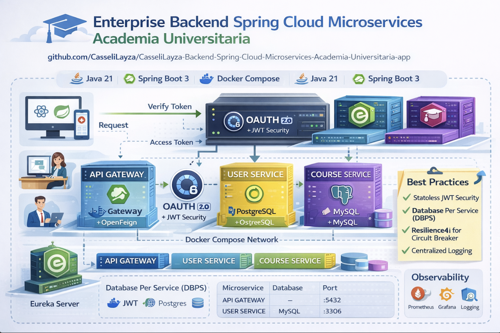

# Backend Spring Cloud Microservices – Academia Universitaria (Enterprise)

Arquitectura **Enterprise Backend** basada en **microservicios** utilizando **Spring Boot 3**, **Spring Cloud** y **Java 21**, diseñada para una **aplicación universitaria/académica** en un entorno productivo.

El sistema implementa **service discovery**, **API Gateway**, **seguridad JWT**, **comunicación vía OpenFeign**, **bases de datos desacopladas por microservicio** y **orquestación con Docker Compose**, siguiendo buenas prácticas reales de arquitectura distribuida.

Repositorio:

```
CasseliLayza-Backend-SpringCloud-Microservices-Academia-Universitaria-app
```

---

## 🏗️ Arquitectura Enterprise

Principios aplicados:

* **Database per Service** (aislamiento total de datos)
* **Service Discovery** con Eureka
* **Single Entry Point** mediante API Gateway
* **Seguridad centralizada** con OAuth + JWT
* **Comunicación síncrona desacoplada** usando OpenFeign
* **Infraestructura reproducible** con Docker Compose

### Componentes

* **EUREKA-SERVER**
  Registro y descubrimiento dinámico de servicios

* **API-GATEWAY**
  Punto de entrada único, enrutamiento, filtros de seguridad

* **OAUTH-SERVER**
  Autenticación, emisión y validación de JWT

* **USER-SERVICE**
  Gestión de usuarios, roles y autenticación

    * Base de datos: **PostgreSQL**

* **COURSE-SERVICE**
  Gestión académica de cursos

    * Base de datos: **MySQL**

---

## 📁 Estructura del Repositorio

```
.
├── API-GATEWAY
├── EUREKA-SERVER
├── OAUTH-SERVER
├── USER-SERVICE
├── COURSE-SERVICE
├── docker-compose.yml
├── pom.xml
└── README.md
```

Cada microservicio:

* Proyecto Spring Boot independiente
* `pom.xml` propio
* `Dockerfile` propio
* Base de datos dedicada

---

## 🔧 Stack Tecnológico

* **Java 21**
* **Spring Boot 3.x**
* **Spring Cloud** (Eureka, Gateway, OpenFeign)
* **Spring Security + JWT**
* **PostgreSQL** (Course Service)
* **MySQL** (User Service)
* **Docker & Docker Compose**
* **Maven**

---

## 🔐 Seguridad

La seguridad sigue un modelo **stateless enterprise**:

* Autenticación centralizada en **OAuth Server**
* Tokens **JWT** firmados
* Validación de tokens en Gateway y microservicios
* Roles y autoridades a nivel de servicio

Flujo simplificado:

1. Cliente autentica en OAuth Server
2. OAuth Server devuelve JWT
3. API Gateway valida y enruta
4. Microservicios confían en el token

---

## 🔁 Comunicación entre Microservicios

La comunicación interna se realiza mediante **OpenFeign**:

* Declarativa
* Desacoplada
* Integrada con Eureka

Ejemplos:

* `COURSE-SERVICE` consulta usuarios vía `USER-SERVICE`
* `USER-SERVICE` obtiene información académica

---

## 🗄️ Bases de Datos (Enterprise Pattern)

| Servicio       | Base de Datos |
| -------------- |---------------|
| USER-SERVICE   | MySQL         |
| COURSE-SERVICE | PostgreSQL    |

✔ Sin acceso cruzado entre bases
✔ Integridad por contrato (API)

---

## 🐳 Docker Compose

El proyecto se ejecuta completamente usando **Docker Compose**:

```bash
docker-compose up --build
```

Incluye:

* Microservicios
* Bases de datos
* Networking interno

---

## 🚀 Puertos (ejemplo)

| Servicio       | Puerto |
| -------------- |--------|
| Eureka Server  | 8761   |
| API Gateway    | 8080   |
| OAuth Server   | 8090   |
| User Service   | 8081   |
| Course Service | 8082   |

---

## 📌 Estado del Proyecto

✔ Arquitectura base enterprise
✔ Seguridad JWT
✔ Comunicación Feign
✔ Bases de datos desacopladas
🚧 Observabilidad, Config Server, Resilience4j

---

## 🎯 Enfoque

Proyecto orientado a:

* Entornos **enterprise reales**
* Escalabilidad horizontal
* Separación de responsabilidades
* Buenas prácticas de microservicios

---

## 👨‍💻 Autor

**Casseli Layza**
Senior Backend Developer
Java | Spring Boot | Spring Cloud | Microservices

---

Este repositorio representa una base sólida para sistemas académicos y universitarios a nivel empresarial.
